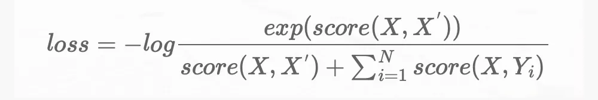

# 模型预训练和fine-tune的思考

> https://mp.weixin.qq.com/s/iE6f3c4rb9JSrz053PmU7w

## **大规模预训练**

预训练+微调的做法，在多个下游领域取得优异的表现。而在过去的一年里，预训练模型更是在往**大而深**的方向发展。

目前，国内已有智源研究院、鹏城实验室、中科院自动化所、阿里、百度、华为、浪潮等科研院所和企业研相继发出“悟道”、“盘古”、“紫东 · 太初”、M6、PLUG、ERNIE 3.0 等大模型。

但是模型在往大而深方向发展的同时，也存在如下亟待解决的问题：

- 如何解释预训练模型的理论基础（如大模型智能的参数规模极限存在吗）
- 如何将大模型高效、低成本的应用于实际系统
- 如何克服构建大模型的数据质量、训练效率、算力消耗、模型交付等诸多障碍
- 如何解决目前大部分大模型普遍缺乏认知能力的问题

## 对比学习

对比学习的出发点在于避免模型坍塌，理想的模型应该符合`aligment`和`uniformity`，即语义相近的句子彼此聚集，语义无关的句子均匀分布。

如果仅仅通过数据增强构建正例，随机句子作为负例，并为其打上 0，1 标签，存在以下问题：

- 数据增强生成正例的变化有限
- 随机搭配成负例，含有除正例组合外其他组合全部为 0 的诱导
- 0，1 标签的赋予太过绝对，对相似性表述不够准确

因此对比学习的核心思想转变为：

```
score(X,X^{'}) >> score(X,Y)
```


其中，X 代表原样本， 代表数据增强的正样本，Y 代表随机选择的负样本。根据该思想，对比学习采用 InfoNCE 损失函数：




通过该损失函数实现正例拉近，负例推远的效果。

## Prompt

prompt 被誉为 NLP 领域的新范式，与预训练+微调的范式相比，其过程分为："pre-train, prompt, and predict"。

**prompt 的出发点在于以更轻量化的方式利用预训练模型，避免微调与预训练之间存在的差异。**

prompt 通过构建模版的方式，将下游任务转为与预训练相似的 MLM 任务，以该方式充分发挥预训练模型的性能。

以文本情感分类任务中，"I love this movie."句子为例，prompt 按照以下方式进行处理：


## 展望未来

首先我认为当前基于数据驱动方法存在如下的问题：

- 长尾效应：自然界中的数据分布就是长尾的，在学习的过程中，模型容易发生过拟合，泛化性较差。
- 数据噪声：有标签的数据，在标注过程中就不可避免的存在噪声。尤其是多位人员一起标注时，不同标注人员根据自身的理解完成数据的标注，但不同的人自身理解存在偏差，因此标注结果极易存在误差。归根到底：标注的规范难以确定，无法统一大家的知识库。

当前我遇到的一些问题分享：模型仍无法很好地处理下述问题：

> 太阳有几只眼睛？
> 姚明与奥尼尔身高谁比较高？
> 猫咪可以吃生蛋黄吗？猫咪是可以吃蛋黄的。这里特定煮熟的白水蛋，猫咪不能吃生鸡蛋，因为生鸡蛋中有细菌。
> 物质都是由分子构成的吗？物质都是由分子构成的，分子又由原子构成-错的！因为有些物质是不含分子的。

这些问题，我总结为两方面的困难：

- 缺乏知识，由于预训练与微调领域存在偏差，模型在下游任务中缺乏特定知识，同时模型在一些常识问题上表现较差。
- 缺乏深度语义的理解，模型表现的更像通过字面匹配完成任务，推理的成分更弱。


